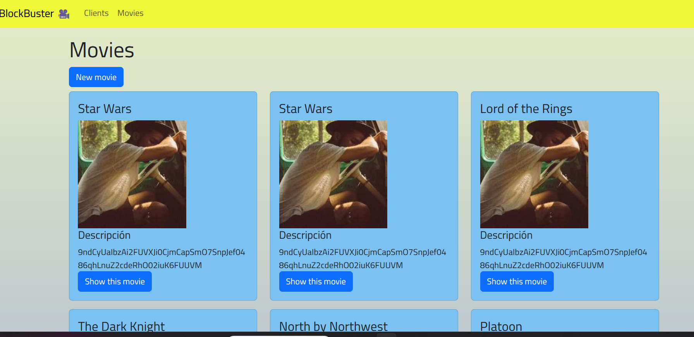

# BLOCKBUSTER 🎥 APP
Blockbuster es una aplicación web para administrar clientes de un establecimiento de arriendo de copias de películas, como lo solían hacer las tiendas tipo Blockbuster. Permite agregar, editar y eliminar clientes y películas, y también visualizarlos en una interfaz intuitiva.Realizado como Desafío Evaluado para Bootcamp Ruby on Rails para Startup, dictado por Inforcap.

## Características

- Administración de clientes: crear, editar y eliminar clientes.
- Administración de películas: agregar, editar y eliminar películas.
- Paginación: muestra los clientes en páginas con 10 clientes por página.
- Integración con Bootstrap: utiliza Bootstrap para el diseño y los estilos.

#Empezando 🚀

Estas instrucciones te guiarán para obtener una copia de este proyecto en funcionamiento en tu máquina local para propósitos de desarrollo y pruebas.

## Requisitos

- Ruby 3.1.1
- Ruby on Rails 7.0.6
- PostgreSQL (base de datos)

Instalación 🔧

1. Clona el repositorio:
    git clone https://github.com/tu-usuario/blockbuster.git

2. Instala las dependencias:
  cd blockbuster
  bundle install

3. Configura la base de datos en el archivo config/database.yml.

4. Crea la base de datos y ejecuta las migraciones:
  rails db:create
  rails db:migrate

5. Opcional: Ejecuta los seed para agregar datos de ejemplo:
  rails db:seed

6. Inicia el servidor:
  rails server

7. La aplicación estará disponible en http://localhost:3000.

Despliegue 📦

1. Precompilar activos: Ejecuta el comando bundle exec rake assets:precompile 

2. Inicia sesión en Heroku (u otro servidor web de preferencia),y a través de Github u otro método de conexión realiza el deploy de esta aplicación.

3. Verificar y solucionar problemas: Accede a tu aplicación en el entorno de producción y verifica que funcione correctamente. Si encuentras algún problema, revisa los registros del servidor y los mensajes de error para solucionarlos.

Contribuyendo 🖇️

Las contribuciones son lo que hacen a la comunidad de código abierto un lugar increíble para aprender, inspirar y crear. Cualquier contribución que hagas es muy apreciada. Si tienes sugerencias, mejoras o encontraste algún error, no dudes en abrir un issue o enviar un pull request.
Wiki 📖

Versionado 📌

Usamos Git para el versionado. Para las versiones disponibles, ve las etiquetas en este repositorio.
Autores ✒️

    Sandra Campos Galeas - Trabajo inicial - Desafío Evaluado por Inforcap

Expresiones de Gratitud 🎁

Estamos agradecidos por las contribuciones de la comunidad a este proyecto. Si encontraste cualquier valor en este proyecto o quieres contribuir, aquí está lo que puedes hacer:

    Comparte este proyecto con otros
    Invítanos un café ☕ o una cerveza 🍺😁
    Inicia un nuevo problema o contribuye con un PR
    Muestra tu agradecimiento diciendo gracias en un nuevo problema.

